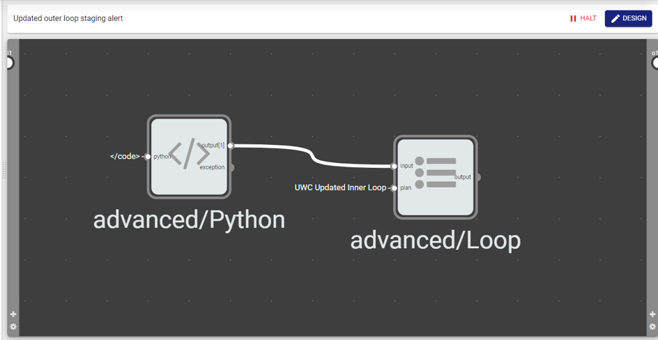
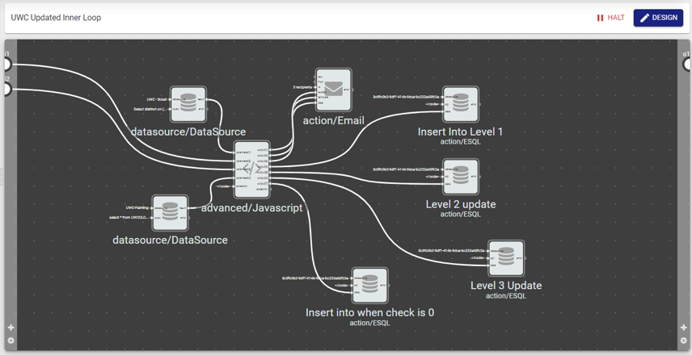

# 3-Tier-Staging-Alert-Using-V-ONE
This code will extract data from PostgreSQL database that is stored in a JSON data format and checks for unattended warning messages and send it to the next stage/tier if the message continues to be unattended after x hours by checking the PostgreSQL data and updating the user's reaction to the message by inserting that data into the SQL database using V-ONE. For example, if no operational level user attended to the warning message after 1 hour, the ticket will be forwarded to the managerial level user and if no managerial level user attended to the warining message after 3 hours the message will be forwarded to the strategic level user using 2 workflow called inner and outer loop. 

# Outer Loop

The outer loop will send the condition of each level into the inner loop. For example, level 1 users will be notified when the message is neglected for 30 minutes, level 2 in 1 hour and level 3 in 4 hours.

# Inner Loop

The inner loop can be split into 5 parts to summarize its functionality

# Inner Loop Part 1
Declare arrays to store the data from data source and some variables to be used as a counter. 

# Inner Loop Part 2
Push the data from the data source into the arrays for data processing later.

# Inner Loop Part 3
Checks the wall input data and the current trigger status for all the stages and triggers an email and push the data into ESQL by storing it in an array under the condition:

-If wall input is 4 hours and stage 3 is empty and stage 2 and stage 1 is not empty 
-If wall input is 1 hour and stage 2 is empty and stage 1 is not empty  
-If wall input is 30 minute 

# Inner Loop Part 4
Construct an email body based on the wall input data using the array that has been created in Part 3.

# Inner Loop Part 5
Pass the data into the email component and ESQL based on the wall input to determine which level the data should be passed to in order to update the table

